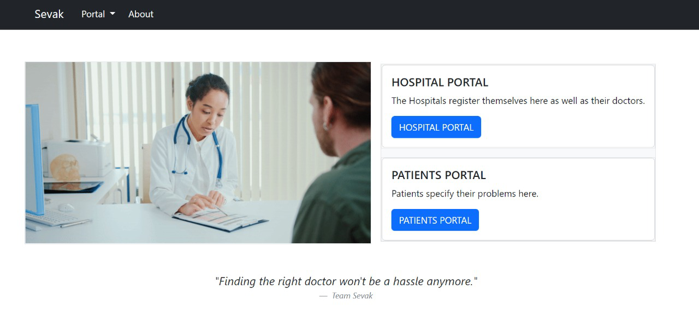

# Project Name- Sevak (Track- Health)
-- Azure deployment link- [Sevak](https://sevak.azurewebsites.net/) :link:  
The technologies utilized in the development of this service include Python, JavaScript, Azure, HTML, CSS, Git, and SQL.

# About the Project-
- Our web application serves as a one-stop resource for patients to locate physicians specialized in treating their specific symptoms by searching for the city, physician's name, or the physician's area of specialization. :raised_back_of_hand:  
- Also, our service provides patients with the convenience of accessing information about the clinics or hospitals where their chosen physician practices, allowing them to consider both hospitals and clinics as options for treatment. :hospital:  
- Hospitals are also able to register with our service and provide information about the doctors they have on staff, thus contributing to our mission of assisting patients in finding physicians in their local area. :white_check_mark: 
- Access to add information about doctors is restricted to authenticated users only. :heavy_check_mark:  

# Target Audience:
Our target audience are patients who are unfamiliar with the local area and wish to determine the number of physicians available to consult or treat their symptoms. :pushpin:

# Team Members: 
- [Royal Simpson Pinto](https://github.com/royalpinto007)  
- [Srinivasa R](https://github.com/Wolfram70)  
- [Tarun S Hegde](https://github.com/tarun-hegde)  
- [Vignaraj Pai](https://github.com/Vignaraj-pai) 

# Challenges we ran into-
