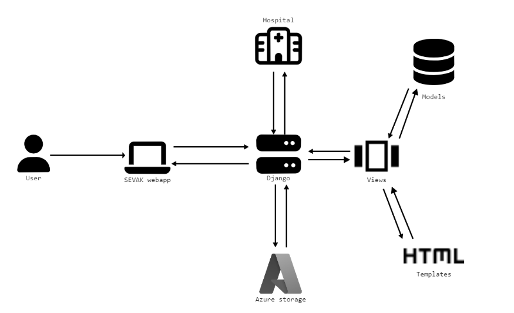

# **Sevak**
> ## Finding the right doctor won't be a hassle anymore!

## **The Team:**
- Royal Simpson Pinto- royalpinto007@icloud.com
- Srinivasa R- srinivasa.r0503@outlook.com
- Tarun S Hegde- tarun.hegde0907@gmail.com
- Vignaraj Pai- vignarajpai@outlook.com

We are four sophomores enrolled at the National Institute of Technology Karnataka, Surathkal, with an anticipated graduation year of 2025.

## **The Concept:**
Finding the right medical professional to treat our symptoms can be a hassle. While there are thousands of hospitals in India, there is currently no established digital solution to help patients locate doctors and hospitals in their area.

To address this issue, Sevak offers hospitals a platform to store all the information on doctors and their specialties. People can find hospitals and doctors with the right specializations through this one-stop web application solution.

## **Project Features:**
- Our web application serves as a one-stop resource for patients to locate physicians specialized in treating their specific symptoms by searching for the city, physician's name, or the physician's area of specialization.
- Our service also provides patients with the convenience of accessing information about the clinics or hospitals where their chosen physician practices, allowing them to consider both hospitals and clinics as options for treatment.
- Hospitals are able to register with our service and provide information about the doctors they have on staff, thus contributing to our mission of assisting patients in finding physicians in their local area.
- Access to add information about doctors is restricted to authenticated users only.

## **Target Audience:**
Our primary target audience is individuals who are new to a city and may have limited knowledge of the top doctors in their area.

The app also enables individuals to search for doctors who specialize in treating specific symptoms. Hospitals will also benefit from this platform, as displaying a large number of doctors and treatment options can increase their appeal to potential patients compared to other facilities.

## **Personas:**
For example, the Akul family recently relocated from Mangalore to Bangalore. Mr. Akul has just taken a new job and is renting an apartment close to his office. However, about a week after moving, he started experiencing chest pains. As a newcomer to the city, Mr. Akul does not know which doctors are available in his area and may not feel comfortable relying on potentially unreliable Google reviews or untrustworthy websites to find a doctor. SEVAK will assist him in finding a cardiology doctor and hospital that suits his needs.

## **How it works:**

  
We are using Python with the Django framework to efficiently host our web app and store data on doctors and hospitals in SQL tables.

The frontend of the app is developed using HTML, CSS, and JavaScript, resulting in a simple yet modern and feature-rich user interface.

## **Core Technologies:**
- Python
- Azure
- HTML
- CSS
- JavaScript
- Git
- SQL

## **The Business Plan:**
To promote the website, we will market it to hospitals and collect data from a large number of hospitals regarding their doctors and specializations.

Once a sufficient number of hospitals are registered, the website will be launched with advertisements to attract users. The platform can then be monetized by charging hospitals a nominal fee to maintain their profile on the site.

## **Business Model:**

There are several potential business models that could be implemented for a healthcare app in the future-

#### Subscription-based:  
Under this model, users would pay a recurring fee in order to access certain features of the app, such as the ability to search for medical professionals and treatment options.

#### Advertising:   
Healthcare providers could pay to advertise their services on the app through sponsored search results or banner ads.

#### Commission-based:   
The app could take a percentage of the fees charged by the medical professionals and hospitals listed on the platform, similar to how online travel agencies function.

#### Freemium:   
The app could be offered for free, with users paying for additional premium features such as more detailed search results or the ability to book appointments directly through the app.

#### Hybrid:   
This model could combine elements of multiple business models, such as offering a basic version for free while charging for premium features and/or allowing healthcare providers to advertise on the platform.
